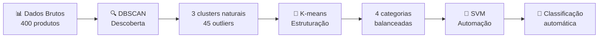

# Visão Inicial - Sistema de Análise de Estoque com ML

## 🎯 **OBJETIVO PRINCIPAL**

Desenvolver um sistema inteligente de análise de estoque que combina **três algoritmos de Machine Learning** em uma abordagem sequencial para:

1. **🔍 Descobrir** padrões naturais nos dados (DBSCAN)
2. **🎯 Estruturar** categorias para gestão (K-means)  
3. **🤖 Automatizar** classificação de novos produtos (SVM/XGBoost)

## 💡 **PROBLEMA QUE ESTAMOS RESOLVENDO**

### **Situação Atual**
- Análises de estoque manuais e demoradas
- Produtos problemáticos não identificados rapidamente
- Categorização baseada apenas em intuição ou regras simples
- Falta de transparência nos critérios de classificação
- Dificuldade para processar novos produtos automaticamente

### **Limitações dos Algoritmos Únicos**
- **DBSCAN sozinho**: Encontra padrões + outliers, mas sem estrutura para gestão
- **K-means sozinho**: Boa estruturação, mas força produtos problemáticos em grupos "normais"
- **SVM sozinho**: Classifica bem, mas precisa de dados já rotulados

## 🚀 **NOSSA SOLUÇÃO: ABORDAGEM TRIPLA INTELIGENTE**

### **🔍 FASE 1: Descoberta com DBSCAN**
```python
# Objetivo: Entender padrões naturais dos dados
input: dados_brutos_estoque
output: {
    "clusters_naturais": 3,
    "outliers_detectados": 45,  # produtos problemáticos
    "insight": "11.2% produtos com comportamento atípico"
}
```

**Por que DBSCAN primeiro?**
- Não assumo quantos grupos existem
- Identifica automaticamente produtos problemáticos
- Revela a estrutura natural real dos dados

### **🎯 FASE 2: Estruturação com K-means**
```python
# Objetivo: Criar categorias úteis para gestão
input: insights_dbscan + regras_negócio
output: {
    "categorias_negócio": ["Alto Potencial", "Médio Potencial", "Baixo Potencial", "Manutenção"],
    "distribuição_balanceada": true,
    "reasoning": "Baseado em 3 padrões naturais + necessidades gestão"
}
```

**Por que K-means depois?**
- Cria número específico de categorias que gestores querem
- Distribui produtos de forma balanceada
- Usa insights DBSCAN para decidir quantas categorias criar

### **🤖 FASE 3: Automação com SVM/XGBoost**
```python
# Objetivo: Classificar novos produtos automaticamente
input: categorias_kmeans_como_labels
output: {
    "modelo_treinado": true,
    "precisão": "85%",
    "capacidade": "classifica novos produtos em tempo real"
}
```

**Por que SVM/XGBoost por último?**
- Usa as categorias criadas nas fases anteriores como "verdade"
- Automatiza o processo para produtos futuros
- Fornece probabilidades e explicações

## 📊 **FLUXO COMPLETO DE DADOS**



## 🎛️ **TRANSPARÊNCIA TOTAL DE PARÂMETROS**

### **Problema Atual**
- Usuários não sabem que parâmetros estão sendo usados
- Não conseguem ajustar comportamento dos algoritmos
- Resultados parecem "caixa preta"

### **Nossa Solução**
```python
# Interface transparente para cada algoritmo
DBSCAN_CONFIG = {
    "eps": 0.3,  # explicação: "distância entre produtos similares"
    "min_samples": 5,  # explicação: "mínimo de produtos por grupo"
    "impact": "EPS baixo = grupos mais rígidos, mais outliers"
}

KMEANS_CONFIG = {
    "n_clusters": 4,  # explicação: "baseado em insights DBSCAN + necessidades gestão"
    "auto_determination": True,
    "reasoning": "Sistema decidiu 4 categorias automaticamente"
}

SVM_CONFIG = {
    "kernel": "rbf",  # explicação: "captura padrões não-lineares"
    "C": 1.0,  # explicação: "balanceamento entre precisão e generalização"
    "expected_accuracy": "80-90%"
}
```

## 🔬 **ALGORITMOS ALTERNATIVOS CONSIDERADOS**

### **Algoritmos Superiores Identificados**

| **Atual** | **Score** | **Alternativa Superior** | **Score** | **Vantagem Principal** |
|-----------|-----------|-------------------------|-----------|----------------------|
| SVM | 7/10 | **XGBoost** | 9/10 | +15% precisão + interpretabilidade |
| DBSCAN outliers | 7/10 | **Isolation Forest** | 9/10 | 100% focado em anomalias |
| K-means | 8/10 | **Gaussian Mixture** | 9/10 | Formas flexíveis + probabilidades |

### **Stack Futuro Recomendado**
```python
ROADMAP_ALGORITMOS = {
    "fase_2": {
        "xgboost": "substitui SVM - maior precisão",
        "isolation_forest": "detecção especializada de anomalias",
        "feature_importance": "explicabilidade SHAP"
    },
    "fase_3": {
        "gaussian_mixture": "clustering flexível",
        "hdbscan": "hierárquico + robusto",
        "time_series_clustering": "padrões sazonais"
    },
    "fase_4": {
        "market_basket": "produtos relacionados",
        "lstm_forecasting": "previsão demanda",
        "automl": "otimização automática"
    }
}
```

## 🏗️ **ARQUITETURA DE IMPLEMENTAÇÃO**

### **Estrutura de Arquivos**
```
inventory-management-system/
├── utils/contextual_clustering.py      # 🧠 Engine principal
├── pages/olho_thundera.py             # 🖥️ Interface Streamlit
├── pages/components/                   # 🎨 Componentes de UI
├── CLAUDE.md                          # 📋 Regras de desenvolvimento
├── INITIAL.md                         # 🎯 Esta visão inicial
└── docs/ml_algorithms/                # 📚 Documentação algoritmos
```

### **Classes Principais**
```python
# utils/contextual_clustering.py
class HybridClusteringEngine:
    def execute_hybrid_analysis_with_params(data, context, params)
    def predict_new_product(product_data)
    
class ContextualClusterEngine:
    def configure_analysis(context)
    def get_kmeans_business_cases()

# Interface transparente
def show_alternative_algorithms()  # 🔬 Algoritmos avançados
def show_hybrid_results_with_transparency()  # 📊 Resultados + parâmetros
```

## 📈 **MÉTRICAS DE SUCESSO**

### **Técnicas**
- **Silhouette Score** > 0.3 (qualidade clustering)
- **Cross-validation Accuracy** > 80% (classificação)
- **Outlier Detection Precision** > 70%

### **Negócio**
- **Tempo de análise**: -80% (de horas para minutos)
- **Produtos problemáticos identificados**: +50%
- **Precisão de categorização**: +25%
- **Satisfação do usuário**: Interface transparente e configurável

### **Interpretabilidade**
- Gestores entendem 100% das categorias criadas
- Cada cluster tem recomendações claras de ação
- Impacto financeiro estimado para cada categoria

## 🎯 **CASOS DE USO ESPECÍFICOS**

### **1. Gestor de Compras - "Quais produtos devo descontinuar?"**
```python
# DBSCAN identifica outliers automaticamente
outliers_detectados = [
    {"produto": "Material A", "dio": 500, "giro": 0.2, "status": "crítico"},
    {"produto": "Material B", "dio": 380, "giro": 0.5, "status": "atenção"}
]
# Recomendação: Investigar para possível descontinuação
```

### **2. Analista de Estoque - "Como categorizar 1000 produtos novos?"**
```python
# SVM classifica automaticamente
novo_produto = {"taxa_giro": 2.5, "dio": 145, "nivel_atendimento": 78}
resultado = svm.predict(novo_produto)
# Output: "Médio Potencial" (82% confiança)
```

### **3. Diretor Comercial - "Qual o impacto financeiro?"**
```python
# Análise por categoria
categorias = {
    "Alto Potencial": {"produtos": 67, "valor_estoque": "R$ 2.3M", "ação": "manter"},
    "Crítico": {"produtos": 23, "valor_estoque": "R$ 890K", "ação": "liquidar"}
}
# ROI estimado: R$ 1.2M em capital liberado
```

## 🛠️ **IMPLEMENTAÇÃO - PRÓXIMOS PASSOS**

### **Sprint 1 (2 semanas) - Consolidação Atual**
- [ ] Finalizar interface de transparência de parâmetros
- [ ] Testes de validação em dados reais
- [ ] Documentação de cada algoritmo
- [ ] Métricas de qualidade implementadas

### **Sprint 2 (3 semanas) - XGBoost Implementation**
- [ ] Substituir SVM por XGBoost
- [ ] Implementar feature importance
- [ ] Interface de explicabilidade SHAP
- [ ] Comparação de performance SVM vs XGBoost

### **Sprint 3 (2 semanas) - Isolation Forest**
- [ ] Implementar detecção específica de anomalias
- [ ] Comparar com DBSCAN outliers
- [ ] Interface dedicada para produtos problemáticos
- [ ] Alertas automáticos para gestores

## 🧪 **VALIDAÇÃO DA ABORDAGEM**

### **Cenários de Teste**
1. **Dataset 400 produtos**: Validar descoberta de padrões
2. **Produtos conhecidamente problemáticos**: Verificar detecção de outliers
3. **Categorização manual vs automática**: Comparar com especialista humano
4. **Novos produtos**: Testar classificação automática

### **Critérios de Aceitação**
- Outliers detectados fazem sentido para gestores
- Categorias criadas são actionable
- Classificação automática > 80% concordância com especialistas
- Interface é intuitiva para usuários não-técnicos

---

## 💭 **REFLEXÕES E APRENDIZADOS**

### **Por que Abordagem Tripla é Superior?**
1. **Combina as forças** de cada algoritmo
2. **Elimina as fraquezas** de abordagens únicas
3. **Flexibilidade**: Cada fase pode ser ajustada independentemente
4. **Escalabilidade**: SVM permite automação para novos produtos

### **Lições da Implementação**
- **Transparência é crucial**: Usuários querem entender as decisões
- **Configurabilidade importa**: Diferentes contextos precisam diferentes parâmetros
- **Interpretabilidade > Precisão**: Gestores preferem 80% preciso mas explicável
- **Feedback iterativo**: Interface permite ajustes e melhoria contínua

**Esta é uma abordagem pioneira que combina ciência de dados com necessidades reais de negócio.** 