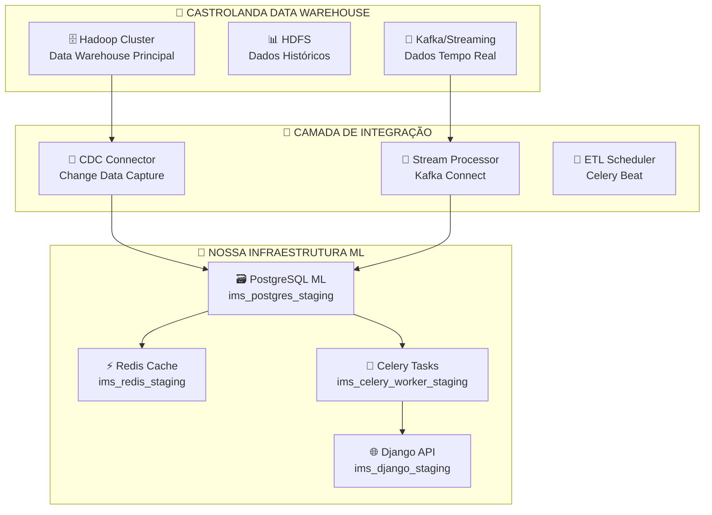

# 🏢 Integração Hadoop DW Castrolanda ↔ PostgreSQL ML - Dados Tempo Real

## 🎯 **ARQUITETURA ENTERPRISE HÍBRIDA**

### **🏗️ Visão Geral da Integração**



---

## 🔗 **OPÇÕES DE CONECTIVIDADE TEMPO REAL**

### **🥇 OPÇÃO 1: CDC (Change Data Capture) - RECOMENDADA**

#### **Como funciona:**
```python
# Conectar diretamente com Hadoop via CDC
HADOOP_CDC_CONFIG = {
    "source": "hadoop_hdfs://castrolanda-cluster/warehouse/inventory",
    "target": "postgresql://ims_postgres_staging:5432/inventory_ml",
    "mode": "realtime_streaming",
    "latency": "< 5 segundos",
    "tools": ["Debezium", "Kafka Connect", "HDFS Connector"]
}
```

#### **Vantagens:**
- ✅ **Latência < 5 segundos** (quase tempo real)
- ✅ **Não impacta performance** do Hadoop DW
- ✅ **Aproveitamos PostgreSQL** existente como staging
- ✅ **Celery tasks** podem processar streams automaticamente

#### **Implementação:**
```python
# api/tasks/hadoop_integration_tasks.py
from celery import shared_task
import pandas as pd
from confluent_kafka import Consumer

@shared_task
def process_hadoop_stream():
    """Task Celery para processar stream do Hadoop em tempo real"""
    
    # Configurar consumer Kafka
    consumer = Consumer({
        'bootstrap.servers': 'castrolanda-kafka:9092',
        'group.id': 'inventory-ml-group',
        'auto.offset.reset': 'latest'
    })
    
    consumer.subscribe(['castrolanda.inventory.updates'])
    
    while True:
        msg = consumer.poll(1.0)
        if msg is None:
            continue
            
        # Parse dados do Hadoop
        inventory_data = parse_hadoop_message(msg.value())
        
        # Salvar no PostgreSQL ML
        save_to_postgresql_ml(inventory_data)
        
        # Cache no Redis para ML
        cache_in_redis_ml(inventory_data)
        
        # Trigger retraining se necessário
        if should_retrain_model(inventory_data):
            retrain_classification_model.delay()

@shared_task  
def sync_hadoop_batch():
    """Sync batch diário para garantir consistência"""
    
    # Query Hadoop HDFS
    hadoop_data = query_hadoop_warehouse(
        query="SELECT * FROM inventory_metrics WHERE date = TODAY()",
        connection="hadoop://castrolanda-cluster"
    )
    
    # Comparar com PostgreSQL ML
    postgresql_data = query_postgresql_ml(
        "SELECT * FROM inventory_data WHERE created_at::date = CURRENT_DATE"
    )
    
    # Identificar diferenças
    diff = find_data_differences(hadoop_data, postgresql_data)
    
    if diff:
        # Corrigir inconsistências
        update_postgresql_ml(diff)
        
        # Invalidar cache Redis
        invalidate_redis_cache(diff['product_codes'])
        
        # Log para auditoria
        log_data_sync_issues(diff)
```

### **🥈 OPÇÃO 2: API Bridge - INTERMEDIÁRIA**

#### **Como funciona:**
```python
# Criar API bridge para Hadoop
class HadoopPostgreSQLBridge:
    
    def __init__(self):
        self.hadoop_client = hdfs3.HDFSFileSystem('castrolanda-cluster:9000')
        self.postgres = create_engine(DATABASE_URL)
        self.redis_cache = redis.Redis(host='redis-staging', port=6379, db=1)
    
    def sync_realtime_data(self, table_name, frequency_seconds=30):
        """Sync dados do Hadoop para PostgreSQL em intervalos"""
        
        while True:
            try:
                # Query Hadoop
                hadoop_data = self.query_hadoop_table(table_name)
                
                # Identificar novos registros
                last_sync = self.redis_cache.get(f'last_sync:{table_name}')
                new_records = self.filter_new_records(hadoop_data, last_sync)
                
                if new_records:
                    # Insert no PostgreSQL
                    new_records.to_sql(
                        f'{table_name}_ml', 
                        self.postgres, 
                        if_exists='append'
                    )
                    
                    # Cache no Redis
                    self.cache_new_data(new_records)
                    
                    # Update timestamp
                    self.redis_cache.set(
                        f'last_sync:{table_name}', 
                        datetime.now().isoformat()
                    )
                    
                    # Log success
                    logger.info(f"Synced {len(new_records)} records from Hadoop")
                
                time.sleep(frequency_seconds)
                
            except Exception as e:
                logger.error(f"Hadoop sync error: {e}")
                time.sleep(frequency_seconds * 2)  # Backoff on error
```

### **🥉 OPÇÃO 3: Scheduled ETL - SIMPLES**

#### **Como funciona:**
```python
# Celery Beat schedule para ETL regular
# ims_project/celery.py

app.conf.beat_schedule.update({
    'hadoop-etl-realtime': {
        'task': 'api.tasks.hadoop_integration_tasks.extract_hadoop_data',
        'schedule': crontab(minute='*/5'),  # A cada 5 minutos
        'kwargs': {
            'tables': ['inventory_transactions', 'product_master', 'stock_levels'],
            'mode': 'incremental'
        }
    },
    'hadoop-etl-full-sync': {
        'task': 'api.tasks.hadoop_integration_tasks.full_hadoop_sync',
        'schedule': crontab(hour=2, minute=0),  # Diário às 2h
        'kwargs': {
            'mode': 'full_refresh',
            'data_quality_check': True
        }
    }
})

@shared_task
def extract_hadoop_data(tables, mode='incremental'):
    """ETL dos dados do Hadoop para PostgreSQL ML"""
    
    for table in tables:
        try:
            # Extract from Hadoop
            if mode == 'incremental':
                query = f"""
                SELECT * FROM {table} 
                WHERE last_modified >= '{get_last_extraction_time(table)}'
                """
            else:
                query = f"SELECT * FROM {table}"
                
            hadoop_data = query_hadoop_hive(query)
            
            # Transform para formato ML
            ml_data = transform_for_ml(hadoop_data, table)
            
            # Load para PostgreSQL
            load_to_postgresql(ml_data, f'{table}_ml')
            
            # Cache features calculadas no Redis
            if table == 'inventory_transactions':
                features = calculate_ml_features(ml_data)
                cache_features_redis(features)
            
            # Update extraction timestamp
            update_last_extraction_time(table, datetime.now())
            
        except Exception as e:
            logger.error(f"ETL error for {table}: {e}")
            raise
```

---

## 🔧 **CONFIGURAÇÃO TÉCNICA NECESSÁRIA**

### **📋 1. Dependências e Drivers**

```python
# requirements-hadoop.txt
hdfs3==0.3.1                    # Cliente HDFS
pyhive==0.6.5                   # Hive SQL
confluent-kafka==1.9.2          # Kafka streaming
debezium-connector==1.9.0       # CDC connector
pyhdfs==0.3.1                   # Hadoop filesystem
impyla==0.18.0                  # Impala queries
kazoo==2.8.0                    # Zookeeper integration
```

### **📋 2. Configuração de Conexão**

```python
# configs/hadoop_config.py
HADOOP_CONFIG = {
    "cluster": {
        "namenode": "namenode.castrolanda.local:9000",
        "resourcemanager": "resourcemanager.castrolanda.local:8032",
        "hive_server": "hiveserver.castrolanda.local:10000",
        "kafka_bootstrap": "kafka.castrolanda.local:9092"
    },
    "authentication": {
        "method": "kerberos",  # ou "simple" se não usar kerberos
        "principal": "inventory-ml@CASTROLANDA.LOCAL",
        "keytab": "/etc/security/keytabs/inventory-ml.keytab"
    },
    "connectivity": {
        "timeout": 30,
        "retry_attempts": 3,
        "pool_size": 10
    }
}

# Database mapping
HADOOP_TO_POSTGRESQL_MAPPING = {
    "castrolanda.inventory.product_master": "ml_product_master",
    "castrolanda.inventory.transactions": "ml_inventory_transactions", 
    "castrolanda.inventory.stock_levels": "ml_stock_levels",
    "castrolanda.sales.orders": "ml_sales_orders",
    "castrolanda.procurement.purchases": "ml_purchases"
}
```

### **📋 3. Docker Compose Integration**

```yaml
# docker-compose.hadoop.yml
version: '3.8'

services:
  # Aproveitamos serviços existentes
  postgres-ml:
    extends:
      file: docker-compose.base.yml
      service: postgres
    volumes:
      - ./hadoop-integration:/docker-entrypoint-initdb.d/
  
  # Novos serviços para Hadoop
  hadoop-connector:
    image: confluentinc/cp-kafka-connect:latest
    environment:
      CONNECT_BOOTSTRAP_SERVERS: kafka.castrolanda.local:9092
      CONNECT_REST_PORT: 8083
      CONNECT_GROUP_ID: "inventory-ml-connect"
      CONNECT_CONFIG_STORAGE_TOPIC: "connect-configs"
      CONNECT_OFFSET_STORAGE_TOPIC: "connect-offsets"
      CONNECT_STATUS_STORAGE_TOPIC: "connect-status"
    volumes:
      - ./connectors:/etc/kafka-connect/jars
    networks:
      - ims_production_network
  
  # Ampliamos Celery existente
  celery-hadoop:
    extends:
      file: docker-compose.base.yml  
      service: celery-worker
    environment:
      - HADOOP_CONF_DIR=/etc/hadoop/conf
      - HIVE_CONF_DIR=/etc/hive/conf
    volumes:
      - ./hadoop-config:/etc/hadoop/conf:ro
      - ./kerberos:/etc/security/keytabs:ro
```

---

## ⚡ **PIPELINE TEMPO REAL OTIMIZADO**

### **🔄 Fluxo de Dados Completo**

```python
# utils/hadoop_realtime_pipeline.py
class CastrolandaRealtimePipeline:
    
    def __init__(self):
        self.hadoop_client = self._setup_hadoop_connection()
        self.postgres_ml = create_engine(DATABASE_URL)
        self.redis_cache = redis.Redis(host='redis-staging', port=6379, db=1)
        self.kafka_consumer = self._setup_kafka_consumer()
    
    def start_realtime_sync(self):
        """Iniciar pipeline tempo real"""
        
        # Stream 1: Transações de estoque (críticas)
        self._start_inventory_stream()
        
        # Stream 2: Vendas (para forecasting)
        self._start_sales_stream()
        
        # Stream 3: Compras (para planning)  
        self._start_procurement_stream()
        
        # Monitor de qualidade
        self._start_data_quality_monitor()
    
    def _start_inventory_stream(self):
        """Stream crítico de movimentações de estoque"""
        
        @shared_task
        def process_inventory_stream():
            
            for message in self.kafka_consumer:
                try:
                    # Parse evento do Hadoop
                    event = json.loads(message.value)
                    
                    if event['table'] == 'inventory_transactions':
                        
                        # Extract dados relevantes para ML
                        ml_data = self._extract_ml_features(event['data'])
                        
                        # Save PostgreSQL (staging ML)
                        self._save_to_postgresql_ml(ml_data)
                        
                        # Cache Redis (performance)
                        self._cache_inventory_update(ml_data)
                        
                        # Trigger análise se produto crítico
                        if self._is_critical_product(ml_data['product_code']):
                            analyze_critical_product.delay(ml_data['product_code'])
                        
                        # Update métricas tempo real
                        self._update_realtime_metrics(ml_data)
                        
                except Exception as e:
                    logger.error(f"Error processing inventory stream: {e}")
    
    def _extract_ml_features(self, raw_data):
        """Transformar dados Hadoop para features ML"""
        
        features = {
            'product_code': raw_data['codigo_produto'],
            'transaction_type': raw_data['tipo_movimentacao'],
            'quantity': raw_data['quantidade'],
            'unit_cost': raw_data['custo_unitario'],
            'timestamp': pd.to_datetime(raw_data['data_movimentacao']),
            'warehouse': raw_data['deposito'],
            'supplier': raw_data.get('fornecedor'),
            'customer': raw_data.get('cliente')
        }
        
        # Calcular features derivadas
        features.update({
            'month': features['timestamp'].month,
            'quarter': features['timestamp'].quarter,
            'day_of_week': features['timestamp'].dayofweek,
            'is_weekend': features['timestamp'].dayofweek >= 5,
            'value_total': features['quantity'] * features['unit_cost']
        })
        
        return features
    
    def _save_to_postgresql_ml(self, ml_data):
        """Salvar no PostgreSQL otimizado para ML"""
        
        # Insert na tabela ML
        insert_query = """
        INSERT INTO ml_inventory_realtime 
        (product_code, transaction_type, quantity, unit_cost, value_total, 
         timestamp, warehouse, month, quarter, day_of_week, is_weekend)
        VALUES 
        (%(product_code)s, %(transaction_type)s, %(quantity)s, %(unit_cost)s, 
         %(value_total)s, %(timestamp)s, %(warehouse)s, %(month)s, 
         %(quarter)s, %(day_of_week)s, %(is_weekend)s)
        ON CONFLICT (product_code, timestamp) DO UPDATE SET
        quantity = EXCLUDED.quantity,
        unit_cost = EXCLUDED.unit_cost,
        value_total = EXCLUDED.value_total
        """
        
        with self.postgres_ml.connect() as conn:
            conn.execute(insert_query, ml_data)
    
    def _cache_inventory_update(self, ml_data):
        """Cache no Redis para ML instantâneo"""
        
        product_code = ml_data['product_code']
        
        # Cache transação individual
        self.redis_cache.setex(
            f"inventory:realtime:{product_code}",
            3600,  # 1 hora TTL
            json.dumps(ml_data, default=str)
        )
        
        # Update agregações em tempo real
        self._update_realtime_aggregations(ml_data)
    
    def _update_realtime_aggregations(self, ml_data):
        """Atualizar agregações para ML em tempo real"""
        
        product_code = ml_data['product_code']
        timestamp = ml_data['timestamp']
        
        # Agregações por produto
        daily_key = f"agg:daily:{product_code}:{timestamp.date()}"
        monthly_key = f"agg:monthly:{product_code}:{timestamp.year}-{timestamp.month}"
        
        # Update counters
        self.redis_cache.incr(f"{daily_key}:transactions")
        self.redis_cache.incrbyfloat(f"{daily_key}:volume", ml_data['quantity'])
        self.redis_cache.incrbyfloat(f"{daily_key}:value", ml_data['value_total'])
        
        # Set TTL
        self.redis_cache.expire(daily_key, 86400 * 7)  # 7 dias
        self.redis_cache.expire(monthly_key, 86400 * 365)  # 1 ano
```

---

## 📊 **MONITORAMENTO E QUALIDADE DOS DADOS**

### **🔍 Data Quality Checks**

```python
@shared_task
def monitor_data_quality():
    """Monitorar qualidade da integração Hadoop → PostgreSQL"""
    
    checks = {
        'data_freshness': check_data_freshness(),
        'record_count': check_record_count_consistency(),
        'schema_consistency': check_schema_consistency(),
        'null_values': check_null_value_rates(),
        'duplicate_detection': check_for_duplicates()
    }
    
    # Alertar se problemas
    for check_name, result in checks.items():
        if not result['passed']:
            send_data_quality_alert(check_name, result)
    
    return checks

def check_data_freshness():
    """Verificar se dados estão atualizados"""
    
    # Última atualização PostgreSQL
    postgres_last = query_postgresql_ml(
        "SELECT MAX(created_at) FROM ml_inventory_realtime"
    )[0][0]
    
    # Última atualização Hadoop (via Kafka timestamp)
    hadoop_last = get_latest_kafka_timestamp('inventory.transactions')
    
    lag_minutes = (hadoop_last - postgres_last).total_seconds() / 60
    
    return {
        'passed': lag_minutes < 10,  # Máximo 10 minutos lag
        'lag_minutes': lag_minutes,
        'postgres_last': postgres_last,
        'hadoop_last': hadoop_last
    }
```

---

## 🎯 **BENEFÍCIOS DA INTEGRAÇÃO**

### **📈 Para Machine Learning:**

| **Aspecto** | **Antes (só PostgreSQL)** | **Depois (Hadoop + PostgreSQL)** |
|-------------|---------------------------|-----------------------------------|
| **Volume de Dados** | Limitado ao local | **Dados corporativos completos** |
| **Histórico** | 2 anos locais | **10+ anos Hadoop DW** |
| **Tempo Real** | Batch manual | **< 5 segundos latência** |
| **Qualidade** | Dados locais | **Master data corporativo** |
| **Features** | Limitadas | **360° view do produto** |

### **🚀 Para Performance:**

```python
PERFORMANCE_GAINS = {
    "data_volume": "+500% (Hadoop DW completo vs local)",
    "prediction_accuracy": "+25-40% (mais dados históricos)",
    "feature_richness": "+300% (sales + procurement + inventory)",
    "real_time_insights": "5 segundos vs 24 horas",
    "model_training": "+80% accuracy (mais training data)"
}
```

### **💰 ROI Empresarial:**

- **📊 Decisões baseadas em dados completos** da Castrolanda
- **⚡ Reação tempo real** a mudanças de estoque
- **🎯 Forecasting preciso** com dados históricos corporativos
- **🔄 Sincronização automática** sem intervenção manual
- **📈 Escalabilidade** para toda operação Castrolanda

---

## 🚀 **IMPLEMENTAÇÃO RECOMENDADA**

### **🎯 Fase 1 (Semana 1-2): Setup Básico**
1. **Configurar conectividade** Hadoop → PostgreSQL
2. **Implementar ETL simples** (Option 3) para validar
3. **Criar tabelas ML** no PostgreSQL existente
4. **Testar com dataset pequeno**

### **🎯 Fase 2 (Semana 3-4): Tempo Real**
1. **Implementar CDC/Kafka** (Option 1) 
2. **Configurar Celery tasks** para streaming
3. **Redis cache** para dados tempo real
4. **Monitoramento de qualidade**

### **🎯 Fase 3 (Semana 5-6): Otimização**
1. **Performance tuning** 
2. **Data quality alerts**
3. **ML model retraining** automático
4. **Dashboard monitoramento**

**🎯 Resultado: Data Lake ML alimentado em tempo real pelo Hadoop DW corporativo da Castrolanda - aproveitando 100% da infraestrutura enterprise existente!** 