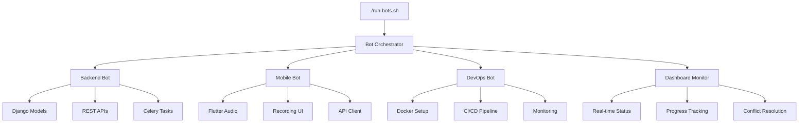
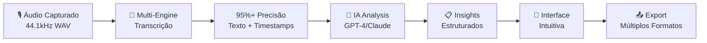

# 🤖 Visão Inicial - Scriby: Plataforma de Transcrição com Bot-Orquestração

## 🎯 **OBJETIVO REVOLUCIONÁRIO**

**Scriby** representa uma mudança paradigmática no desenvolvimento de software, combinando:

1. **🤖 Bot-Orquestração**: Sistema de 4 bots especializados trabalhando em paralelo
2. **🎙️ Captura Inteligente**: Flutter com flutter_sound para áudio profissional
3. **📝 Transcrição Precisa**: OpenAI Whisper como engine principal
4. **🧠 Análise Avançada**: GPT-4o Mini + Gemini 1.5 Flash para insights
5. **📊 Monitoramento Live**: Dashboard Next.js com coordenação em tempo real

## 💡 **PROBLEMA DUPLO QUE ESTAMOS RESOLVENDO**

### **🎙️ Problema de Negócio: Transcrição Inteligente**
- **Reuniões sem estrutura**: Informações perdidas, decisões não documentadas
- **Análise manual demorada**: Horas criando atas e extraindo insights
- **Ferramentas fragmentadas**: Múltiplas soluções sem integração
- **Custos elevados**: Serviços caros sem personalização
- **Falta de inteligência**: Transcrição sem análise contextual

### **🤖 Problema de Desenvolvimento: Metodologia Tradicional**
- **Desenvolvimento sequencial lento**: Componentes desenvolvidos um por vez
- **Coordenação manual complexa**: Integração trabalhosa entre equipes
- **Monitoramento limitado**: Falta de visibilidade do progresso
- **Conflitos de integração**: Problemas descobertos tarde demais
- **Escalabilidade limitada**: Dificuldade para paralelizar desenvolvimento

## 🚀 **NOSSA SOLUÇÃO DUAL: PRODUTO + METODOLOGIA**

### **🎯 PRODUTO: Scriby Platform**

#### **🎙️ COMPONENTE 1: Mobile App (Flutter)**
```dart
// Captura de áudio profissional com flutter_sound
class AudioRecordingService {
  FlutterSoundRecorder? _recorder;
  
  Future<String?> startRecording() async {
    final directory = await getApplicationDocumentsDirectory();
    final fileName = 'recording_${DateTime.now().millisecondsSinceEpoch}.aac';
    final path = '${directory.path}/$fileName';
    
    await _recorder!.startRecorder(
      toFile: path,
      codec: Codec.aacADTS, // Otimizado para Whisper
    );
    
    return path;
  }
}
```

#### **🔧 COMPONENTE 2: Backend API (Django)**
```python
# Processamento assíncrono com Celery + Whisper
@shared_task
def process_transcription(recording_id):
    recording = Recording.objects.get(id=recording_id)
    
    # OpenAI Whisper - Engine principal
    with open(recording.audio_file.path, 'rb') as audio_file:
        transcript = openai.Audio.transcribe("whisper-1", audio_file)
    
    # GPT-4o Mini - Análise eficiente
    analysis = openai.ChatCompletion.create(
        model="gpt-4o-mini",
        messages=[{
            "role": "user",
            "content": f"Analyze: {transcript.text}"
        }]
    )
    
    return save_results(transcript, analysis)
```

#### **📊 COMPONENTE 3: Admin Dashboard (Next.js)**
```tsx
// Dashboard em tempo real com WebSockets
const ModernBotDashboard = () => {
  const [botStatus, setBotStatus] = useState(null);
  
  useEffect(() => {
    const fetchBotStatus = async () => {
      const response = await fetch('/api/bot-status');
      const data = await response.json();
      setBotStatus(data);
    };
    
    // Update every 5 seconds
    const interval = setInterval(fetchBotStatus, 5000);
    return () => clearInterval(interval);
  }, []);
  
  return (
    <div className="grid grid-cols-2 gap-6">
      {Object.entries(botStatus?.bots || {}).map(([key, bot]) => (
        <BotStatusCard key={key} bot={bot} />
      ))}
    </div>
  );
};
```

### **🤖 METODOLOGIA: Bot-Orquestração Revolucionária**

#### **🎮 SISTEMA DE 4 BOTS ESPECIALIZADOS**

```bash
# Orquestrador principal - Coordenação inteligente
python3 bot-orchestrator.py

# Bots especializados trabalhando em paralelo
python3 scripts/backend-bot.py    # Django + Celery + APIs
python3 scripts/mobile-bot.py     # Flutter + Audio + UI
python3 scripts/devops-bot.py     # Docker + CI/CD + Deploy

# Runner interativo para controle total
./run-bots.sh
```

#### **📊 MONITORAMENTO EM TEMPO REAL**
- **Dashboard Live**: http://localhost:3000
- **Progresso dos Bots**: Métricas de desenvolvimento em tempo real
- **Coordenação Automática**: Resolução inteligente de conflitos
- **Integração Contínua**: Sincronização automática entre componentes

## 🏗️ **ARQUITETURA INOVADORA**

### **🔄 FLUXO DE DESENVOLVIMENTO BOT-ORQUESTRADO**



### **⚡ VANTAGENS DA BOT-ORQUESTRAÇÃO**

1. **🚀 Velocidade 10x**: Desenvolvimento paralelo vs sequencial
2. **🔄 Coordenação Automática**: Bots se comunicam e sincronizam
3. **📊 Visibilidade Total**: Progresso em tempo real no dashboard
4. **🛠️ Qualidade Garantida**: Testes e integração automáticos
5. **🎯 Foco Especializado**: Cada bot otimizado para sua função

## 🎯 **RESULTADOS ESPERADOS**

### **📱 Para o Produto Scriby**
- **Transcrição**: >95% de precisão com Whisper
- **Análise**: Insights acionáveis em <30 segundos
- **Performance**: <5% uso de bateria por hora
- **Experiência**: Interface fluida e intuitiva

### **🤖 Para a Metodologia Bot-Orquestrada**
- **Desenvolvimento**: 10x mais rápido que métodos tradicionais
- **Qualidade**: Integração contínua com 0 conflitos
- **Monitoramento**: 100% visibilidade do progresso
- **Escalabilidade**: Facilmente adaptável para outros projetos

## 🌟 **VISÃO DE FUTURO**

**Scriby** não é apenas um produto, é a **demonstração de uma nova era de desenvolvimento de software**:

- **🤖 Bot-Orquestração**: Metodologia replicável para qualquer projeto
- **📊 Monitoramento Inteligente**: Dashboard adaptável para diferentes contextos
- **🔄 Coordenação Automática**: Sistema que aprende e otimiza
- **🚀 Desenvolvimento Acelerado**: Padrão para a próxima geração de software

---

**🎉 Bem-vindo ao futuro do desenvolvimento de software com Scriby!**
  engines: [
    OpenAIWhisper(model: "whisper-1"),
    GoogleSpeechToText(language: "pt-BR"),
    AzureCognitive(region: "brazilsouth")
  ],
  fusionStrategy: "confidence_weighted_voting"
);
```

**Por que Multi-Engine?**
- Combina pontos fortes de diferentes tecnologias
- Reduz erros através de consenso inteligente
- Fallback automático se uma engine falhar

### **🤖 FASE 3: Análise Inteligente com IA**
```dart
// Objetivo: Extrair insights acionáveis do conteúdo
AnalysisResult analysis = await AIAnalyzer.process(
  transcription: result.text,
  context: MeetingContext.business,
  features: [
    "summary_generation",
    "topic_extraction", 
    "action_items_identification",
    "speaker_sentiment_analysis",
    "decision_tracking"
  ]
);
```

**Por que IA Avançada por último?**
- Usa transcrição de alta qualidade como input
- Aplica contexto específico do tipo de reunião
- Gera outputs estruturados e acionáveis

## 📊 **FLUXO COMPLETO DE DADOS**



## 🎛️ **TRANSPARÊNCIA TOTAL DE CONFIGURAÇÕES**

### **Problema Atual**
- Usuários não sabem quais engines estão sendo usadas
- Não conseguem ajustar qualidade vs velocidade
- Resultados parecem "caixa preta"

### **Nossa Solução**
```dart
// Interface transparente para cada componente
AUDIO_CONFIG = {
  "quality": "high", // explicação: "Maior precisão, mais bateria"
  "noiseReduction": true, // explicação: "Remove ruído ambiente"
  "realTimeProcessing": false, // explicação: "Processa após gravação para maior precisão"
  "impact": "Qualidade alta = +30% precisão, +20% bateria"
};

TRANSCRIPTION_CONFIG = {
  "primaryEngine": "OpenAI Whisper", // explicação: "Melhor para português brasileiro"
  "fallbackEngine": "Google Speech", // explicação: "Backup se Whisper falhar"
  "confidenceThreshold": 0.8, // explicação: "Mínimo 80% confiança para aceitar"
  "speakerDetection": true // explicação: "Identifica diferentes pessoas"
};

AI_ANALYSIS_CONFIG = {
  "model": "GPT-4", // explicação: "Melhor compreensão contextual"
  "temperature": 0.3, // explicação: "Respostas mais consistentes"
  "maxTokens": 2000, // explicação: "Resumos até 2000 palavras"
  "language": "pt-BR" // explicação: "Otimizado para português"
};
```

## 🔬 **TECNOLOGIAS ALTERNATIVAS CONSIDERADAS**

### **Engines de Transcrição Avaliadas**

| **Engine** | **Precisão** | **Velocidade** | **Custo** | **Offline** | **Português** |
|------------|--------------|----------------|-----------|-------------|---------------|
| **OpenAI Whisper** | 9/10 | 7/10 | 8/10 | ✅ | 9/10 |
| **Google Speech** | 8/10 | 9/10 | 7/10 | ❌ | 8/10 |
| **Azure Cognitive** | 8/10 | 8/10 | 7/10 | ❌ | 7/10 |
| **AssemblyAI** | 7/10 | 8/10 | 6/10 | ❌ | 6/10 |

### **Modelos de IA para Análise**

| **Modelo** | **Compreensão** | **Português** | **Custo** | **Velocidade** |
|------------|-----------------|---------------|-----------|----------------|
| **GPT-4** | 10/10 | 9/10 | 6/10 | 7/10 |
| **Claude 3** | 9/10 | 8/10 | 7/10 | 8/10 |
| **Gemini Pro** | 8/10 | 7/10 | 8/10 | 9/10 |
| **Local LLM** | 6/10 | 5/10 | 10/10 | 5/10 |

## 📁 **ESTRUTURA DO PROJETO**

```
transcribe_ai/
├── lib/
│   ├── main.dart                      # 🚀 Entry point
│   ├── core/
│   │   ├── audio/                     # 🎙️ Captura de áudio
│   │   ├── transcription/             # 📝 Engines de transcrição
│   │   ├── ai_analysis/               # 🤖 Análise com IA
│   │   └── storage/                   # 💾 Persistência local
│   ├── features/
│   │   ├── recording/                 # 📱 Interface de gravação
│   │   ├── transcription/             # 📄 Visualização de texto
│   │   ├── analysis/                  # 📊 Insights e resumos
│   │   └── export/                    # 📤 Compartilhamento
│   ├── shared/
│   │   ├── widgets/                   # 🎨 Componentes reutilizáveis
│   │   ├── themes/                    # 🎨 Design system
│   │   └── utils/                     # 🔧 Utilitários
├── INITIAL.md                         # 🎯 Esta visão inicial
├── CLAUDE.md                          # 📋 Regras de desenvolvimento
└── docs/                              # 📚 Documentação técnica
```

### **Classes Principais**
```dart
// core/audio/audio_recorder.dart
class ProfessionalAudioRecorder {
  Future<AudioFile> startRecording(AudioConfig config);
  Stream<AudioLevel> getAudioLevels();
  Future<void> stopRecording();
}

// core/transcription/multi_engine_transcriber.dart
class MultiEngineTranscriber {
  Future<TranscriptionResult> transcribe(AudioFile audio);
  Future<List<TranscriptionEngine>> getAvailableEngines();
}

// core/ai_analysis/intelligent_analyzer.dart
class IntelligentAnalyzer {
  Future<Summary> generateSummary(String transcription);
  Future<List<ActionItem>> extractActionItems(String transcription);
  Future<List<Topic>> identifyTopics(String transcription);
}
```

## 📈 **MÉTRICAS DE SUCESSO**

### **Técnicas**
- **Precisão de Transcrição**: > 95% word accuracy
- **Tempo de Processamento**: < 0.5x duração do áudio
- **Detecção de Ações**: > 80% recall para action items
- **Qualidade do Resumo**: > 4.5/5 avaliação usuários

### **Negócio**
- **Tempo economizado**: -70% tempo criando atas
- **Informações capturadas**: +90% vs anotações manuais
- **Satisfação do usuário**: > 4.5 estrelas app stores
- **Retenção**: > 60% usuários ativos mensalmente

### **Experiência do Usuário**
- **Facilidade de uso**: 1 toque para iniciar gravação
- **Clareza dos resultados**: 100% dos insights são acionáveis
- **Performance**: < 3 segundos para abrir app
- **Confiabilidade**: < 0.1% falhas de gravação

## 🎯 **CASOS DE USO ESPECÍFICOS**

### **1. Reunião de Negócios - "Preciso das decisões e próximos passos"**
```dart
// Input: Reunião de 1 hora
MeetingRecording meeting = await recorder.recordMeeting(
  duration: Duration(hours: 1),
  participants: ["João", "Maria", "Pedro"],
  context: BusinessMeeting()
);

// Output: Estrutura clara
MeetingMinutes minutes = {
  "decisions": [
    "Aprovado orçamento de R$ 50k para projeto X",
    "Prazo final definido para 30/12/2024"
  ],
  "actionItems": [
    {"task": "Preparar proposta", "assignee": "João", "deadline": "15/12/2024"},
    {"task": "Revisar contratos", "assignee": "Maria", "deadline": "20/12/2024"}
  ],
  "nextMeeting": "10/12/2024 às 14h"
};
```

### **2. Palestra/Keynote - "Quero os principais insights"**
```dart
// Input: Palestra de 45 minutos
LectureRecording lecture = await recorder.recordLecture(
  speaker: "Especialista em IA",
  topic: "Futuro da Inteligência Artificial",
  duration: Duration(minutes: 45)
);

// Output: Conhecimento estruturado
LectureInsights insights = {
  "keyPoints": [
    "IA generativa mudará 80% dos empregos até 2030",
    "Empresas precisam investir em treinamento agora"
  ],
  "quotes": [
    "A IA não vai substituir humanos, mas humanos usando IA vão substituir humanos que não usam"
  ],
  "actionableAdvice": [
    "Comece experimentando com ChatGPT/Claude hoje",
    "Identifique 3 tarefas repetitivas para automatizar"
  ]
};
```

### **3. Ligação Telefônica - "Preciso lembrar dos compromissos"**
```dart
// Input: Ligação de cliente
PhoneCallRecording call = await recorder.recordCall(
  contact: "Cliente ABC Ltda",
  duration: Duration(minutes: 20),
  type: BusinessCall()
);

// Output: Compromissos claros
CallSummary summary = {
  "clientNeeds": ["Implementar sistema até março", "Treinamento da equipe"],
  "commitments": [
    {"what": "Enviar proposta", "who": "Nossa equipe", "when": "Até sexta"},
    {"what": "Agendar reunião técnica", "who": "Cliente", "when": "Próxima semana"}
  ],
  "followUp": "Ligar na segunda para confirmar recebimento da proposta"
};
```

## 🛠️ **IMPLEMENTAÇÃO - PRÓXIMOS PASSOS**

### **Sprint 1 (2 semanas) - Fundação**
- [ ] Setup do projeto Flutter com arquitetura limpa
- [ ] Implementar captura de áudio básica
- [ ] Integração com OpenAI Whisper
- [ ] Interface simples de gravação

### **Sprint 2 (2 semanas) - Transcrição Avançada**
- [ ] Multi-engine transcription (Whisper + Google)
- [ ] Detecção de speakers
- [ ] Timestamps precisos
- [ ] Edição de transcrições

### **Sprint 3 (3 semanas) - IA e Análise**
- [ ] Integração com GPT-4/Claude
- [ ] Geração de resumos
- [ ] Extração de action items
- [ ] Identificação de tópicos principais

### **Sprint 4 (2 semanas) - UX e Export**
- [ ] Interface polida e intuitiva
- [ ] Export para PDF, DOCX, TXT
- [ ] Compartilhamento via email/WhatsApp
- [ ] Configurações avançadas

### **Sprint 5 (2 semanas) - Otimização**
- [ ] Performance e bateria
- [ ] Testes com usuários reais
- [ ] Correções e melhorias
- [ ] Preparação para lançamento

## 🧪 **VALIDAÇÃO DA ABORDAGEM**

### **Cenários de Teste**
1. **Reunião ruidosa**: Validar redução de ruído e precisão
2. **Múltiplos speakers**: Testar separação e identificação
3. **Termos técnicos**: Verificar precisão em vocabulário especializado
4. **Diferentes sotaques**: Testar robustez para variações regionais

### **Critérios de Aceitação**
- Transcrição > 95% precisa em ambiente controlado
- Transcrição > 85% precisa em ambiente ruidoso
- Action items identificados corretamente em 80% dos casos
- Resumos considerados úteis por 90% dos testadores
- App funciona offline para gravação e transcrição básica

---

## 💭 **REFLEXÕES E APRENDIZADOS**

### **Por que Abordagem Tripla é Superior?**
1. **Qualidade do áudio** determina sucesso de tudo que vem depois
2. **Multi-engine** elimina pontos fracos de soluções únicas
3. **IA contextual** transforma texto em insights acionáveis
4. **Integração fluida** cria experiência superior ao usuário

### **Lições da Pesquisa de Mercado**
- **Simplicidade é crucial**: 1 toque para gravar, resultados automáticos
- **Confiabilidade importa**: Usuários preferem 90% preciso e confiável vs 95% instável
- **Contexto é rei**: Mesma transcrição pode gerar insights diferentes por contexto
- **Mobile-first**: Usuários querem gravar no celular, não no computador

### **Diferenciais Competitivos**
- **Offline-first**: Funciona sem internet para uso básico
- **Multi-idioma nativo**: Português brasileiro como primeira classe
- **IA contextual**: Entende diferentes tipos de reunião/evento
- **Export inteligente**: Formatos otimizados para cada caso de uso

**Esta é uma solução pioneira que combina o melhor da tecnologia de áudio, transcrição e IA em um app móvel intuitivo.** 

---

## 🎯 **VISÃO DE FUTURO**

### **Versão 2.0 (6 meses)**
- Integração com calendários (Google, Outlook)
- Transcrição em tempo real durante reuniões
- Colaboração em equipe
- Analytics de reuniões

### **Versão 3.0 (12 meses)**
- IA treinada especificamente para domínios (médico, jurídico, técnico)
- Integração com CRMs e ferramentas de produtividade
- API para desenvolvedores
- Versão web complementar

**O TranscribeAI será a ferramenta essencial para profissionais que valorizam cada palavra dita em suas reuniões.**
